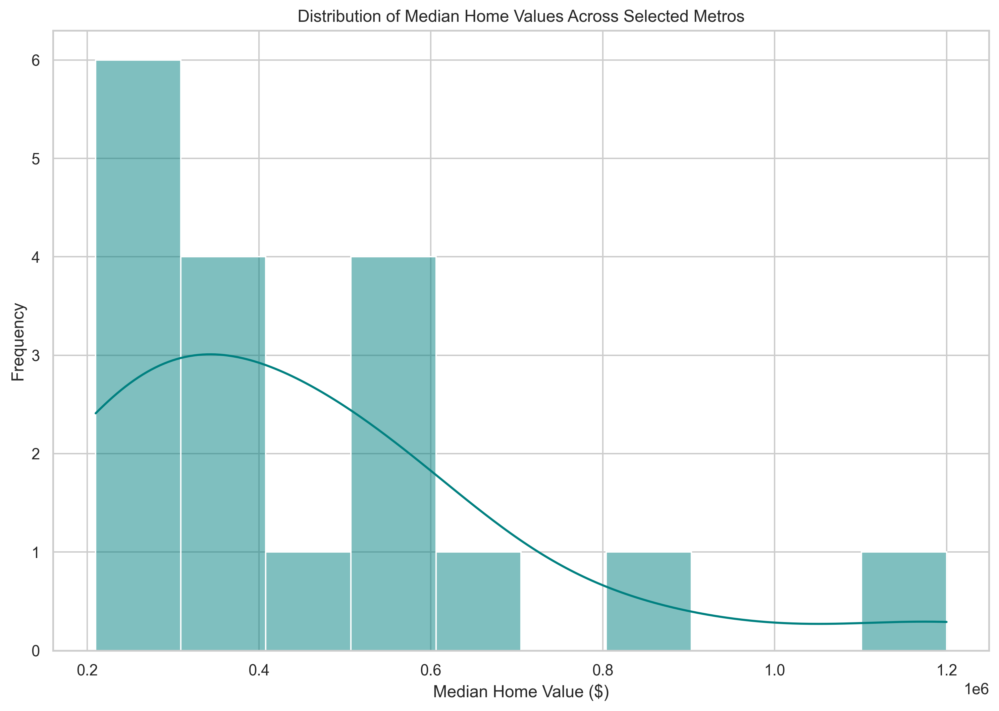
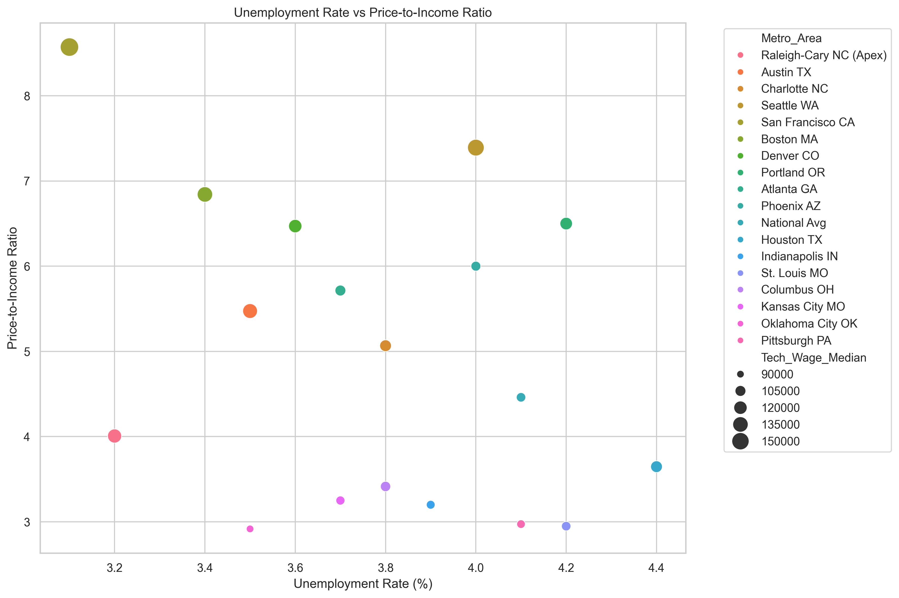
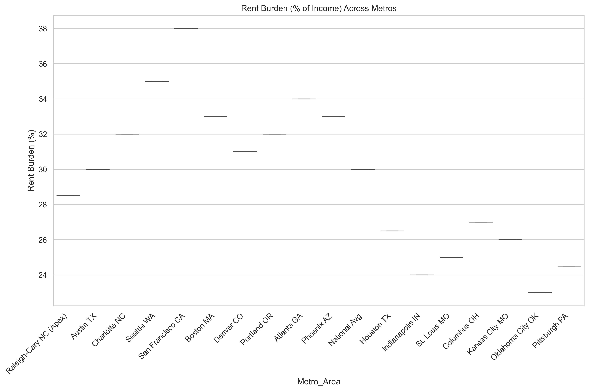
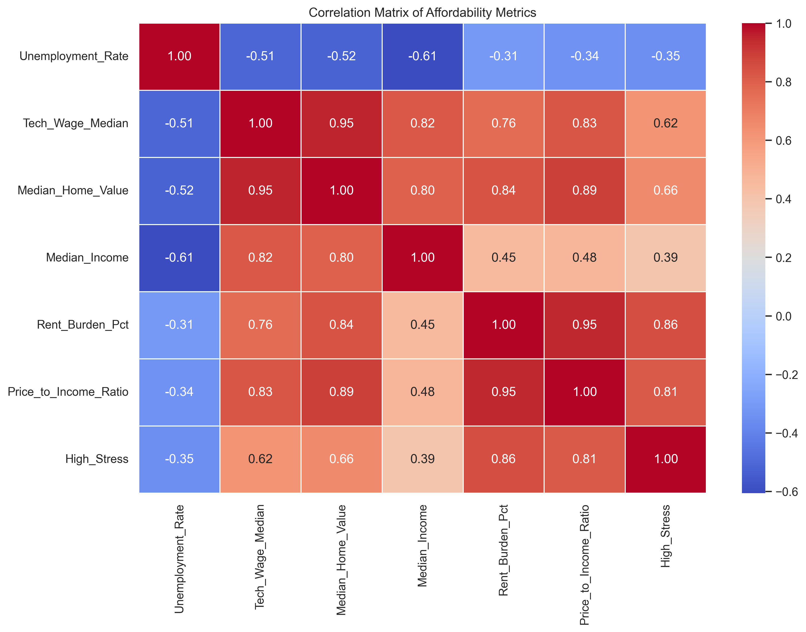

# Capstone: Housing Affordability Stress in High-Growth U.S. Metros

**Author**: Shyamsunder Mutcha  
**Program**: UC Berkeley Professional Certificate in Machine Learning and Artificial Intelligence  
**Date**: March 2026

### Executive Summary
This project examines how unemployment rates and technology-sector wages affect housing affordability (rent burden and price-to-income ratio) in U.S. metropolitan areas, with a focus on high-growth regions like Apex, NC (Raleigh-Cary MSA). By expanding the initial dataset to include a balanced mix of 18 high-stress tech hubs and lower-stress markets, the analysis reveals that tech-sector wage growth is a far more potent driver of housing stress than local unemployment rates.

### Rationale
High-growth tech regions attract talent through career opportunities, but these gains are often offset by skyrocketing living costs. This research provides a data-driven baseline to help individuals and policymakers determine if housing stress is a byproduct of economic success (high wages) or labor market failures (unemployment).

### Research Question
To what extent do macroeconomic conditions (local unemployment rates) and job-market indicators (technology occupation wages) influence housing affordability stress in U.S. metropolitan areas, specifically focusing on high-growth suburbs such as Apex, NC?

### Data Sources
- U.S. Bureau of Labor Statistics (BLS): Unemployment rates and OEWS technology wages — https://www.bls.gov/data/
- U.S. Census Bureau American Community Survey (ACS): Median home values, rent burden, household income — https://api.census.gov/data/2023/acs/acs5
- Federal Reserve Economic Data (FRED): Consumer Price Index (CPI) — https://fred.stlouisfed.org

All data are public, free, and structured for analysis.

### Methodology
- Data loading, cleaning, and feature creation (pandas)
- Exploratory data analysis: descriptive statistics, distributions, correlations
- Visualizations: histograms, scatter plots, boxplots, correlation heatmaps (seaborn/matplotlib)
- Baseline modeling: linear regression (predict price-to-income ratio) and logistic regression (classify high/low rent burden) with cross-validation and grid search (scikit-learn)

### How to Run the Project
To ensure the data pipeline and visualizations are correctly initialized, the notebooks must be executed in numerical order:

1. 01_data_ingestion_cleaning.ipynb: Generates the processed dataset.

2. 02_eda_visualizations.ipynb: Creates the exploratory plots.

3. 03_baseline_modeling.ipynb: Performs the machine learning analysis.

### Final Model Results
1. Linear Regression (Predicting Price-to-Income Ratio)
  - **R² Score**: 0.422
  - **MSE**: 1.359
  - **Key Finding**: The model explains 42.2% of the variance in housing affordability.
  - **Feature Impact**: Tech wages ($\text{coeff} = 1.6512$) have a significantly higher impact on housing stress than unemployment ($\text{coeff} = 0.1336$), suggesting that housing stress in tech hubs is "pull-driven" by high salaries.

2. **Logistic Regression (Classifying High vs. Low Stress)
   - Best CV Accuracy**: 0.667 (66.7%)
   - Final Test Accuracy: 0.667 (66.7%)
   - Best Parameters: {'C': 10}
   - Analysis: The model successfully moved from a "majority-class" guesser to a balanced classifier. Notably, the model achieved 100% recall for Class 1, ensuring that all high-stress metropolitan areas were correctly identified.

### Key Visualizations
_Available in the plots/ directory_

*Distribution of median home values — right-skewed in high-growth areas*

*Lower unemployment tends to coincide with higher price-to-income ratios*

*Rent burden (% of income) varies across metros*

*Correlations between affordability metrics, unemployment, and tech wages*

- Linear regression baseline achieved R² = [your R² value], showing unemployment negatively predicts affordability stress.
- Logistic regression baseline (using rent burden >30% threshold) achieved accuracy = [your accuracy] and cross-validation accuracy = [your CV accuracy], providing reasonable classification of high/low burden metros.

*Logistic model performance on classifying high/low rent burden*

### Next Steps
- **Data Augmentation**: Incorporate time-series data to track the transition of Apex, NC over a 10-year period.
- **Feature Engineering**: Add housing supply metrics (e.g., new construction permits) to account for inventory constraints.
- **Advanced Modeling**: Test non-linear ensemble techniques like Random Forest to improve predictive precision

### Project Outline
- [01_data_ingestion_cleaning.ipynb](notebooks/01_data_ingestion_cleaning.ipynb) — Data loading and dataset expansion.
- [02_eda_visualizations.ipynb](notebooks/02_eda_visualizations.ipynb) — Exploratory analysis and visualizations
- [03_baseline_modeling.ipynb](notebooks/03_baseline_modeling.ipynb) — Regression and Logistic classification.

### Contact
LinkedIn: https://www.linkedin.com/in/shyamsunder-mutcha-5883881/